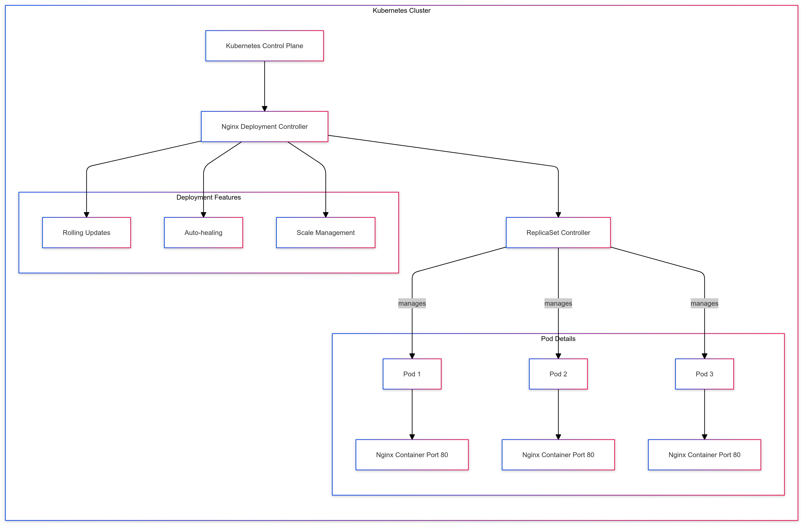

# 🚀 Deploy Nginx Using Kubernetes Deployment

## 📋 Overview
This project demonstrates the deployment of Nginx using Kubernetes Deployment resources, showcasing the power of container orchestration in modern infrastructure. A Deployment in Kubernetes is a higher-level abstraction over a ReplicaSet that provides additional functionality to manage application lifecycles effectively.

Through this project, I've learned how Deployments manage sets of identical pods, ensuring they run and scale as needed while providing sophisticated lifecycle management, including updates and rollbacks. The implementation focuses on creating a production-ready environment with three replicas of Nginx, demonstrating high availability and scalability principles.

## 🏗 Architecture
<figure>
 

     
     
<strong>Fig: Project architecture diagram and workflow</strong> (Another very simple architecture available in the assets directory)
 
 

</figure>

## 💻 Technical Stack
### Core Components

## 🎯 Knowledge Gained
### Kubernetes Concepts Mastered
1. **Deployment Management**
   - Understanding Deployment objects and their role
   - Managing application lifecycles
   - Handling rolling updates and rollbacks
   - Scaling applications efficiently

2. **Pod Management**
   - Pod lifecycle understanding
   - Container configurations
   - Resource allocation
   - Health monitoring

3. **ReplicaSet Understanding**
   - Automatic scaling mechanisms
   - Self-healing capabilities
   - High availability configurations

## 💡 Practical Skills Acquired
### Technical Competencies
1. **Kubernetes Administration**
   - Creating and managing deployments
   - Implementing both declarative and imperative approaches
   - Troubleshooting deployment issues
   - Managing application scaling

2. **Configuration Management**
   - Writing and maintaining YAML manifests
   - Understanding configuration best practices
   - Managing environment-specific settings

3. **Container Operations**
   - Working with container images
   - Port management and exposure
   - Container networking basics

### DevOps Practices
1. **Infrastructure as Code**
   - Version control for configurations
   - Maintaining reproducible deployments
   - Documentation-driven development

2. **Operational Excellence**
   - Monitoring and logging setup
   - Performance optimization
   - Security best practices

## 🎓 Learning Outcomes
After completing this project, I can now:
1. Design and implement Kubernetes deployments from scratch
2. Choose between declarative and imperative approaches based on requirements
3. Manage application scaling and updates effectively
4. Troubleshoot deployment issues
5. Implement production-grade configurations
6. Write comprehensive deployment documentation
7. Apply best practices for container orchestration
8. Understand the relationship between different Kubernetes objects

## 🔄 Real-World Applications
This knowledge enables me to:
1. Deploy and manage web applications at scale
2. Implement high-availability configurations
3. Handle production deployments with zero-downtime updates
4. Design robust container orchestration strategies
5. Contribute to enterprise-level Kubernetes projects
6. Mentor others in Kubernetes deployment practices

## 📈 Future Learning Path
To build upon this foundation, I plan to explore:
1. Advanced Kubernetes features (Services, Ingress, etc.)
2. Helm charts for package management
3. Custom controllers and operators
4. Advanced monitoring and logging solutions
5. Service mesh implementations
6. Multi-cluster management

## 📫 Contact
- 📧 Email: toriqul.int@gmail.com
- 📱 Phone: 
  - Singapore: +65 8936 7705
  - Bangladesh: +8801765 939006

## 🔗 Project Links
- [GitHub Repository](https://github.com/TheToriqul/Nginx-on-Kubernetes)

---

Feel free to explore, modify, and build upon this configuration as part of my learning journey. You're also welcome to learn from it, and I wish you the best of luck!

# 🚀 Learning Kubernetes Deployments with Nginx

## 📋 Learning Overview
This project represents my journey in mastering Kubernetes Deployments using Nginx as a practical example. Through this hands-on experience, I've gained comprehensive understanding of container orchestration, deployment strategies, and production-ready configurations in Kubernetes environments.

